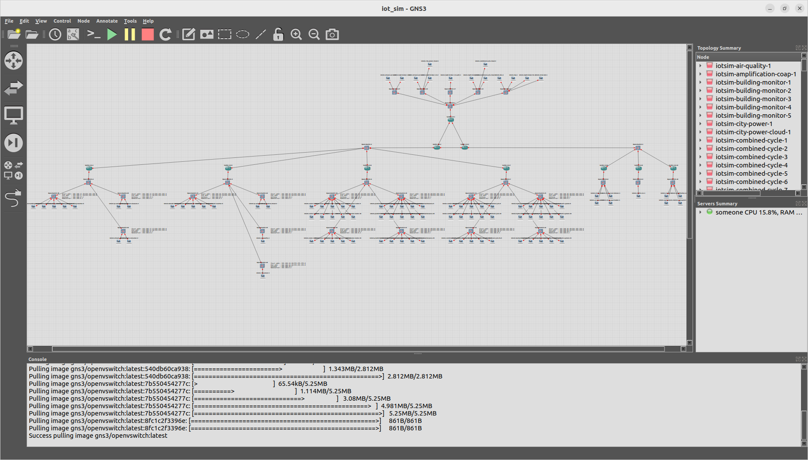

# Gotham Testbed: a Reproducible IoT Testbed for Security Experiments and Dataset Generation

Work in Progres...

Tested on Ubuntu 20.04.4 LTS and 22.04 LTS

---

## Dependencies

- make

- wget

- Python 3

- Docker: https://docs.docker.com/engine/install/

- GNS3: https://www.gns3.com/, https://docs.gns3.com/docs/getting-started/installation/linux
    - Answer 'Yes' when the Wireshark installer asks 'Should non-superusers be able to capture packets?'

## Prerequisites

- Your user should belong to the following groups: ubridge, libvirt, kvm, wireshark, docker. `sudo usermod -aG ubridge,libvirt,kvm,wireshark,docker $USER`. Restart the machine.


- For large topologies with many nodes (containers, VMs) you might need to increase the maximum number of open file descriptors (in the machine running GNS3) to start all the nodes simultaneously. Check the current limit with `ulimit -n`

- KVM virtualization support. When running GNS3 in a virtual machine, enable nested virtualization.

---

## Python virtual environment

Create a Python virtual environment to install the Python dependencies of the project (You might need to install the `python3-venv` package). To interact with the project, activate the virtual environment.

Inside the project's repository directory, run:

```
$ python3 -m venv venv
$ source venv/bin/activate
(venv) $ pip install -r requirements.txt
```

## Template creation

### Build Docker images

All the Dockerfiles and the dependencies that describe the emulated nodes (IoT devices, servers, attackers) are inside the `./Dockerfiles` directory. The build process of some Docker images depend on other images; instead of building them manually, the project includes a `Makefile` to automate the process.

Run `make` to automatically build all the Docker images in the correct order:
```
$ make
```

This can take a long time (approx 30 min depending on the host and network speed); you can parallelize the build process running make with the `-j` flag.

If you modify any Dockerfile, configuration file, program or any other file inside the `./Dockerfiles` directory, run `make` again. It will rebuild the updated images and other images that depend on them.

### Docker template creation

Open GNS3, the GNS3 server must be running.
Inside the `./src` directory run:
```
(venv) $ python3 create_templates.py
```

You can verify the created templates in GNS3 select: Edit > Preferences > Docker containers


### Create router template

Inside the project's repository directory, run:

```
make vyosiso
```

The artifacts (a .iso file and a .qcow2 file) will be downloaded into the `~/Downloads directory`. Follow the instructions to import appliances in GNS3 https://docs.gns3.com/docs/using-gns3/beginners/import-gns3-appliance/. The router appliance file is located at `./router/iotsim-vyos.gns3a`.


## Topology builder

GNS3 must be running.
Inside the `./src` directory run:
```
(venv) $ python3 create_topology_gotham.py
```



## Scenario generator

GNS3 must be running.
Inside the `src/` directory run:
```
(venv) $ python3 run_scenario_gotham.py
```
